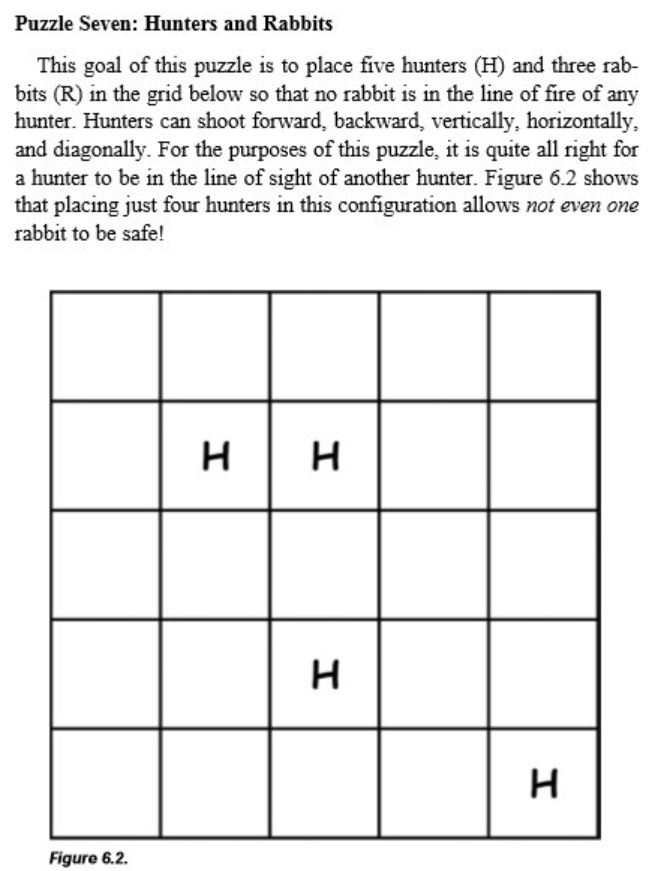
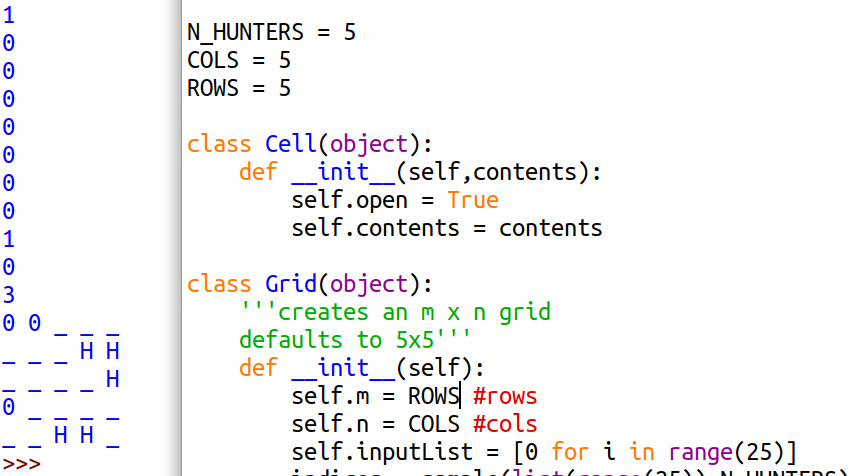

# The Singh Square

Teaching Python to solve the brainteaser posted on Twitter by Sunil Singh:  
  
Great challenge! I made a Grid object which takes a given number of 0's for open spaces and H's for hunters. It removes all the zeroes in a hunter's rows, columns and diagonals and finally counts all the 0's that are left. I leave it running until one setup scores a 3. Here's one solution:  

